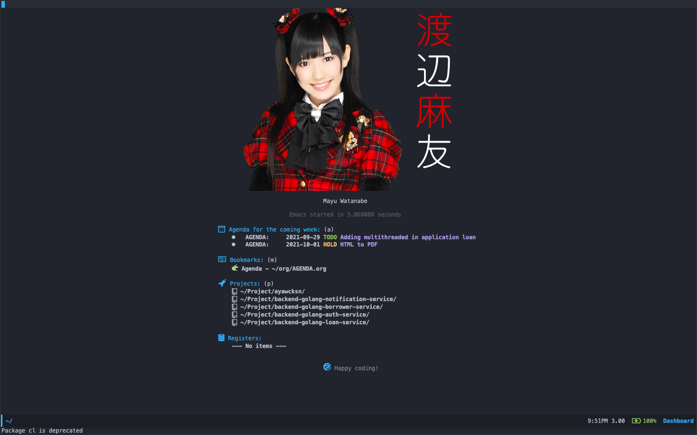

<h1 align="center"> Pramudya Arya Wicaksana </h1>

```golang

package main

import (
	"fmt"
)

type Bio map[string]string

func main() {
	for k, v := range GetBio() {
		fmt.Printf("%+v: %+v\n", k, v)
	}
}

func GetBio() Bio {
	return Bio{
		"- Quick bio:":                    "Game Developer mainly in Visual Novel, Otaku, Tech Enthusiast, Metalhead",
		"- I'm currently working on":      "Senja Solution as Fullstact developer",
		"- I'm currently learning":        "Golang, MongoDB, Typescript, Python, Ruby and Lua"
		"- I'm looking to collaborate on": "Python, Golang and Docker related projects",
		"- I'm looking for help with":     "Anything related to what I am currently learning ??",
		"- Ask me about":                  "Python, NodeJs, Laravel, SQL, Web-Dev, Machine Learning, Penetration Testing, And DevOps",
		"- How to reach me:":              "https://github.com/AyaWcksn"
	}
}
```



<h2 align="left">You can contact me at : </h2>
<p align="left">
  <a href="https://github.com/AyaWcksn">
    
  </a>
  <a href="https://www.linkedin.com/in/pramudya-arya-wicaksana-995607178/">
    
  </a>
  <a href="mailto:pram.aryawcksn@protonmail.ch">
    
  </a>
  <a href="https://discordapp.com/users/770987360972308500">
    
  </a>
  <a href="https://www.reddit.com/user/rya_wcksn">
    
  </a>
</p>
<h2 align="left">Tools</h2>
<div align="left">
  
  
</div>
<h2 align="left">Language</h2>
<div align="left">
  
  
  
  
  
  
  
</div>
<h2 align="left">Database</h2>
<div align="left">
  
  
  
  
</div>
<h2 align="left">Frameworks</h2>
<div align="left">
  
  
  
  
  
  
  
  
  
</div>
<h2 align="left">Operating System</h2>
<h3 align="left">Mobile</h3>
<div align="left">
  
</div>
<h3 align="left">Desktop</h3>
<div align="left">
  <a href="https://archlinux.org/">
  
  </a>
  <a href="https://www.gentoo.org/">
  
  </a>
  <a href="https://www.apple.com/macos/big-sur/">
  
  </a>
</div>
<h2> Get to know </h2>
<a href="#ǝɔϟlʍo" target="_blank">
  
  
</a>
<h2> Spotify </h2>
<p align="left">
  <a target="_blank" href="https://spotify-github-profile.vercel.app/api/view?uid=62ev9v7hqkdv8tp3ijsbz97jk&redirect=true">
    
  </a>
</p>
